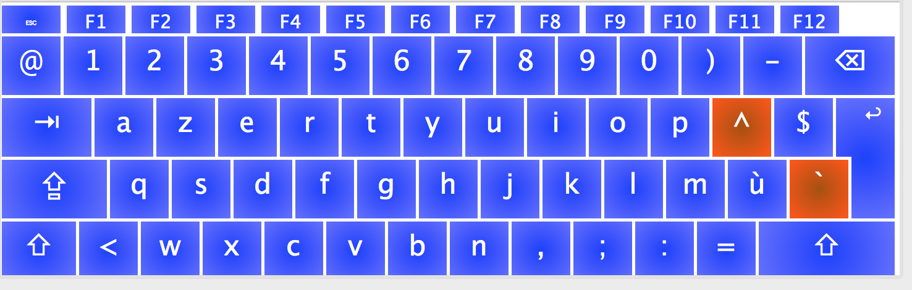
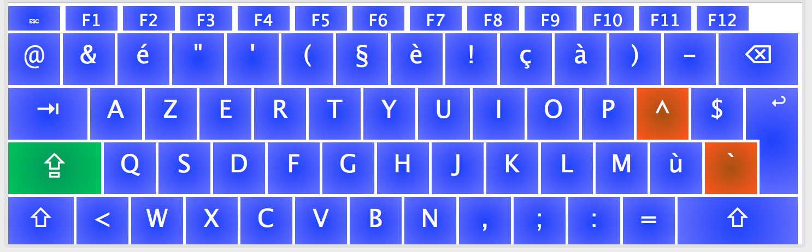

# Azery Numeric

The Apple azerty and Windows azerty (Belgium period) layouts are a bit different.  
This layout is a change to type numbers without shift, and instead output symbols with shift.

Screenshots
===========
**Normal State**

**Shift Pressed**

Installation
============

- Download the repository
- cd */path/to/repository/*
- `sudo cp -r belgian-numeric.bundle /Library/Keyboard\ Layouts/`  
- reboot  
- select new layout from keyboard settings -> input sources  

Credits
=======

The layout is made with [Ukele](http://scripts.sil.org/cms/scripts/page.php?site_id=nrsi&id=ukelele)